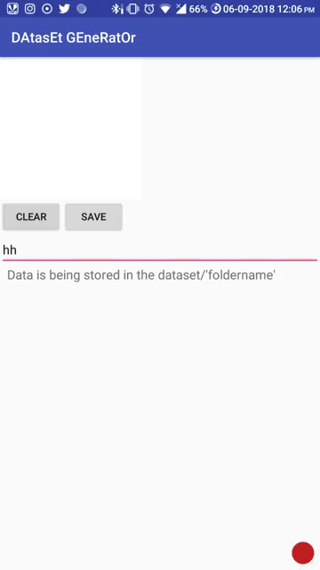

# DatasetGeneratorApp
Android app help to generate data of any type of drawing, as we have to draw by ourselves and save the images in the file storage.

Please give the "Storage Permission" from the setting in application details

apk in link left

File storage location:
  0/Dataset/"foldername"
  
## Demo

  
## Credits
Credits for DrawView code go to [mari-linhares](https://github.com/mari-linhares/mnist-android-tensorflow).
  

